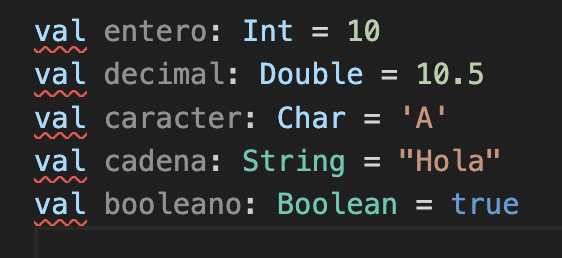
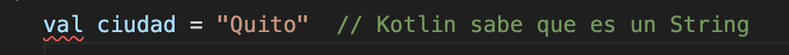
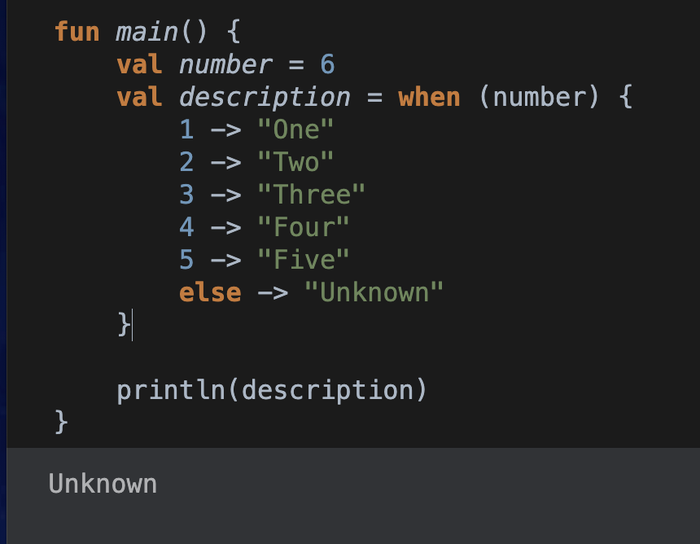

# Tarea Lenguaje Kotlin
## 1. Declaración de Variables
  - Concepto:
  ```
  Las variables en Kotlin pueden ser inmutables (declaradas con val) o mutables (declaradas con var).
  ```
  - Captura:


## 2. Tipos de Datos
  - Concepto:
  ```
  - Los tipos de datos como Int, String, Boolean, Char, entre otros, pueden ser declarados o inferidos por el compilador. Esta flexibilidad y claridad permiten gestionar el almacenamiento y procesamiento de datos en el programa.
  ```
  - Captura:


 
 ## 2.1. Inferencia de Datos
 - Concepto:
  ```
  - Kotlin puede inferir el tipo de una variable sin necesidad de declararlo explícitamente.
  ```
  - Captura:


 
## 3. Condicionales (if/else, when)
  - Concepto:
  ```
  Los condicionales nos permiten que un programa tome decisiones basadas en condiciones. En Kotlin, if/else se pueden usar como una expresión que devuelve un valor, mientras que when es una estructura versátil que reemplaza al switch de otros lenguajes, permitiendo múltiples condiciones y opciones en un formato compacto. Además, el if puede devolver un valor.
  ```
  - Captura:


## 3.1. when: Alternativa a switch en otros lenguajes.
  - Concepto:
  ```
  Permite comparar un valor con múltiples condiciones y ejecutar diferentes bloques de código según el resultado. Se puede usar tanto como una expresión (devuelve un valor) o como una declaración (no devuelve un valor).
  ```
  - Captura:



## 4. Bucles (For)
  - Concepto:
  ```
  Los bucles permiten la repetición de bloques de código según condiciones o iterando sobre colecciones, "for" se usa para recorrer rangos y colecciones.
  ```
  - Captura:


## 4.1. Bucles (while y do while)
  - Concepto:
  ```
  while repite mientras se cumple una condición, y do-while garantiza la ejecución al menos una vez antes de verificar la condición.
  ```
  - Captura:


## 5. Funciones
  - Concepto:
  ```
  Las funciones son bloques de código reutilizables que realizan una tarea específica.Las funciones en Kotlin pueden tener parámetros opcionales con valores por defecto, ser de una sola línea, y devolver resultados. Son fundamentales para la modularidad y la reducción de duplicación de código.
  ```
  - Captura de declaracion de funcion y uso de funcion:


- Captura uso de funcion con valores por defecto:


## 6. Null Satefy
  - Concepto:
  ```
  Kotlin incluye null safety para prevenir errores de referencia nula (NullPointerException), un problema común en muchos lenguajes. Los tipos pueden declararse como no nulos o nulos, y se pueden manejar valores nulos de forma segura mediante operadores como " ?. " (llamada segura) y " ?: " (operador Elvis), haciendo el código más seguro y robusto.
  
  ```

  - Captura:

